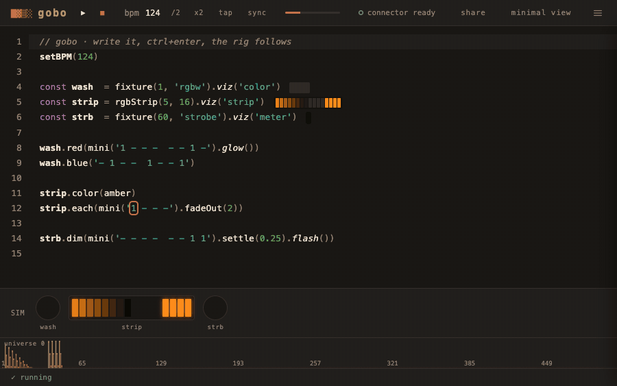

# lumen

**Live-code DMX lighting in your browser.**

Write pattern code, see results instantly on a 512-channel visualizer, and send to real hardware via ArtNet or sACN.

Powered by [@strudel/core](https://strudel.cc) — the same waveform and cycle syntax used for live-coding music, wired up to DMX universes instead of audio.

[](LICENSE)



---

## Try it now

**[Open lumen in your browser](https://nicholaspjm.github.io/lumen-dmx-live-code/)** — no install required.

> The web version runs the full editor and visualizer. To send DMX to real hardware, run the bridge server locally (see below).

---

## Features

- **Live eval** — `Ctrl+Enter` to run; code takes effect on the next tick
- **Pattern engine** — `sine()`, `cosine()`, `square()`, `saw()`, `rand()` and full mini-notation via Strudel
- **512 channels per universe** — multiple universes via `uni()`
- **Real-time visualizer** — 512-bar channel strip + fixture simulation, 30 fps
- **Fixture system** — built-in profiles for RGB, RGBW, moving heads, strobes, and custom definitions
- **Pixel strips** — `rgbStrip()` / `rgbwStrip()` with per-pixel, grid and chase helpers
- **Multiple outputs** — Art-Net 4, sACN (E1.31), OSC, or mock
- **Scenes** — named code buffers in the top bar, autosaved to the browser
- **Fixture library** — built-in, bundled public, saved and session fixtures in one panel, with JSON import/export
- **Reference panel** — click `docs` in the top bar for inline function reference, plus hover help and autocomplete
- **Nine themes** — ember (warm charcoal / terracotta) by default, through to paper, terminal and ikeda

---

## Quick start

### Browser only (no hardware)

Just open the [live link](https://nicholaspjm.github.io/lumen-dmx-live-code/) and start coding. The visualizer shows DMX output in real time.

### With hardware (local dev)

```bash
git clone https://github.com/nicholaspjm/lumen-dmx-live-code.git
cd lumen-dmx-live-code
npm install
npm run dev
```

This starts both the **UI** (http://localhost:3000) and the **bridge** (ws://localhost:3001).

`packages/bridge/bridge.config.json` sets the bridge's startup output. It ships in `artnet`
mode pointed at `127.0.0.1`, which only reaches software on the same machine — edit the host
to your subnet broadcast or a node's IP for real hardware:

```json
{ "mode": "artnet", "artnet": { "host": "192.168.1.255", "port": 6454 } }
```

Supported modes: `artnet`, `sacn`, `osc`, `mock`. Calling `artnet()` / `sacn()` / `osc()` /
`mock()` from editor code overrides this at runtime — see [DMX output configuration](#dmx-output-configuration).

---

## Pattern examples

```js
// Pulse channel 1 over 2 bars
ch(1, sine().slow(2))

// Fast strobe on channel 5
ch(5, square().fast(8))

// RGB fixture on channels 10-12
rgb(10, sine(), 0, cosine().slow(3))

// Static value
ch(3, 200)
ch(7, 0.75)

// Set tempo
setBPM(140)

// Sawtooth chase across 4 channels
ch(1, saw())
ch(2, saw().add(0.25))
ch(3, saw().add(0.5))
ch(4, saw().add(0.75))

// Named fixture access
fixture(1, 'rgb').red(sine())

// Multi-universe
uni(2, 1, sine().slow(4))
```

---

## Keyboard shortcuts

| Key | Action |
|-----|--------|
| `Ctrl+Enter` | Evaluate code |
| `Ctrl+.` | Stop — blackout by default, `freeze` if set that way in settings |
| `Ctrl+Space` | Stop, as an alias that also preempts the autocomplete popup |
| `Ctrl+S` | Save the current scene |
| `Ctrl+Shift+S` | Save as a new scene |
| `Ctrl+Shift+F` | Format the buffer |
| `T` | Tap tempo (ignored while typing in the editor or any input) |

---

## Architecture

```
packages/
  core/     Clock worker, scheduler, pattern eval, DMX state, WS client, fixtures
  bridge/   Node WebSocket server → Art-Net / sACN / OSC / mock UDP
  ui/       Vite frontend — CodeMirror editor, visualizer, sim panel, docs
```

Data flow, one tick:

```
Clock (Web Worker, 60 Hz, setInterval)
   │  postMessage("tick")
   ▼
Scheduler (main thread)
   • advance cyclePos by (bpm / 60 / 4) * dt      (dt clamped ≤ 100 ms)
   • fire per-tick callbacks
   ▼
DMX.tick(cyclePos)
   • zero every universe buffer
   • for each channel def: pattern.queryArc(cyclePos, cyclePos + ε)
   • clamp 0–1, scale to 0–255, write Uint8Array(512)
   ▼
Visualizer (rAF, 30 fps, read-only snapshot)   +   WS sender (wall-clock throttled)
                                                        │
                                                        ▼
                                                      Bridge
                                                        │
                                                        ▼
                                             UDP: Art-Net / sACN / OSC
```

### Engine

- **Clock lives in a Web Worker.** A `setInterval(16)` in [clockWorker.ts](packages/core/src/clockWorker.ts) posts `"tick"` messages to the main thread. Chromium doesn't throttle worker timers, so the clock keeps firing at ~60 Hz even when the tab is backgrounded ([scheduler.ts](packages/core/src/scheduler.ts)).
- **Cycle position** advances by `(bpm / 60) / 4` cycles per second (4 beats per cycle). `dt` is clamped at 100 ms so a machine sleep or long GC pause doesn't send the phase spinning ([scheduler.ts](packages/core/src/scheduler.ts)). An external clock provider (audio playhead) can override `cyclePos`; nothing installs one in this release.
- **Pattern evaluation** uses [@strudel/core](https://strudel.cc) as the actual pattern engine — `sine()`, `saw()`, mini-notation, `.slow / .fast / .add / .range / .early / .late` are real Strudel patterns. Each tick, every registered channel calls `pattern.queryArc(cyclePos, cyclePos + ε)` to sample the value at that exact moment ([dmx.ts](packages/core/src/dmx.ts)). The lumen-specific chain methods `.flash / .glow / .wave` are added by monkey-patching `Pattern.prototype`; user code can add its own with `register(name, fn)` ([eval.ts](packages/core/src/eval.ts)). If Strudel fails to load, evaluation is disabled outright and the status bar says why — reload the page to retry. There is deliberately no degraded waveform mode, because silently running a show on subtly different maths is worse than refusing to run.
- **Live eval is not sandboxed** — user code runs via `new Function(...)` in strict mode with a curated globals object (DMX API, fixture API, Strudel waveforms, `Math`, `console`). Those names shadow, they don't remove: the code runs in the page's own realm. Fast to hot-swap, not safe against hostile code — fine for a local live-coding tool ([eval.ts](packages/core/src/eval.ts), and [SECURITY.md](SECURITY.md)).
- **Universe state is `Map<number, Uint8Array(512)>`.** Zeroed and rewritten from scratch every tick, so a scene swap is atomic at the tick boundary ([dmx.ts](packages/core/src/dmx.ts), [dmx.ts](packages/core/src/dmx.ts)).

### Real-time behavior

The interesting bits for anyone asking "will this hold up during a set":

- **Tab-throttling immune.** The clock is in a worker; the on-screen visualizer's rAF loop is decoupled and never drives DMX. Hide the tab, minimize the window, patterns keep running.
- **Hot swap is atomic.** `evalCode` calls `clearDefs()` which wipes pattern defs *and* universe buffers; the next tick rebuilds everything from the new code ([dmx.ts](packages/core/src/dmx.ts)). No half-applied scene is ever sent to the wire.
- **Send rate is wall-clock throttled**, not "every Nth tick". Sender uses `1000 / sendRate` ms as its send interval (default 60 Hz; 30 / 60 / 120 in settings), so a slow render tick doesn't back up the send queue ([main.ts](packages/ui/src/main.ts), [settings.ts](packages/ui/src/settings.ts)).
- **Going-dark zero-frame.** Idle all-zero universes are skipped to save UDP bandwidth, but when a universe transitions live → all-zero, exactly one trailing zero-frame is sent so downstream fixtures actually latch off — otherwise Art-Net/sACN receivers happily hold the last value forever ([websocket.ts](packages/core/src/websocket.ts)).
- **Per-tick user errors are swallowed.** A broken pattern doesn't kill the clock; that channel just outputs zero until you fix it ([scheduler.ts](packages/core/src/scheduler.ts)).
- **Bridge auto-reconnect** every 2 s on close; sends silently drop while disconnected — no queue, no backpressure ([websocket.ts](packages/core/src/websocket.ts)).
- **Latency floor.** One clock tick (~16 ms) + up to one send interval (~16 ms at 60 Hz) + WS hop + UDP hop. The bridge is stateless: each incoming WS message triggers an immediate UDP send, no coalescing ([bridge/index.ts](packages/bridge/src/index.ts)).
- **Inline pattern widgets** hook the same `onTick` the DMX loop uses rather than a separate rAF, so their visuals stay phase-locked with the lights ([inline-viz.ts](packages/ui/src/inline-viz.ts)). The main 512-bar visualizer runs a separate rAF loop with a read-only snapshot and light exponential smoothing so the on-screen strip never contends with the DMX path ([visualizer.ts](packages/ui/src/visualizer.ts)).

### Output protocols

Bridge is stateless — one WebSocket frame in, one UDP send out. Wire cadence matches whatever the browser sends.

| Mode | Packet | Transport | Notes |
|------|--------|-----------|-------|
| Art-Net | 530-byte ArtDmx (`OpOutput 0x5000`) | UDP to the configured host, port 6454 — unicast or a broadcast address, your choice | Full 512-channel payload each frame |
| sACN (E1.31) | 638-byte E1.31 packet | UDP multicast `239.255.<hi>.<lo>`, port 5568 | Random CID per bridge process, source name `lumen`; one sequence counter shared across universes |
| OSC | `/lumen/<uni>/<ch>` float | UDP unicast | Only channels that are non-zero, plus one zero per channel transitioning off |
| Mock | — | — | Logs the non-zero channels of every 7th frame |

### Fixtures

A fixture profile is just an ordered list of `{offset, name, type}` channel descriptors ([fixtures.ts](packages/core/src/fixtures.ts)). `fixture(start, id)` returns an object where each channel name becomes a setter that writes to `start + offset` on the target universe. Generic helpers `.color(r,g,b,w?) / .off() / .full()` walk the light-emitting channels of whatever fixture you gave them, so the same call works on `rgb`, `rgbw`, `dim-rgbw`, or a moving head ([fixtures.ts](packages/core/src/fixtures.ts)). Pixel strips (`rgbStrip`, `rgbwStrip`) lay out N × 3 or N × 4 contiguous channels and add `.pixel(i, …)`, `.pixelGrid([…])`, `.each(fn)`, `.rainbowChase(…)`. Roll your own with `defineFixture(id, def)`.

---

## DMX output configuration

Set the output from your code, at the top of the editor. Switching modes while running reconfigures the bridge on the fly:

```js
artnet('2.0.0.100')        // Art-Net — node IP to unicast, or a broadcast address
// sacn(1, 100)            // sACN E1.31 — second arg is priority
// osc('127.0.0.1', 9000)  // OSC — /lumen/<uni>/<ch> floats
// mock()                  // console log only
```

All four go through the bridge — the only part that speaks UDP. `npm run dev` starts it with the UI, `npm run dev:bridge` alone. `bridge.config.json` sets the startup default; these calls override it at runtime.

---

## TouchDesigner

Patterns reach TouchDesigner over OSC via the bridge — `osc('127.0.0.1', 9000)` in your scene, an `OSC In CHOP` on the same port in TD, one channel per driven DMX address.

Full setup and Art-Net alternative: **[docs/touchdesigner.md](docs/touchdesigner.md)**.

---

## Troubleshooting

| Symptom | Likely cause | Fix |
|---------|--------------|-----|
| Nothing on the rig, dot reads `disconnected` | Bridge not running, or the page can't reach `ws://<host>:3001` | `npm run dev`, or `npm run dev:bridge` on its own — the page reconnects by itself |
| Dot reads `bridge`, rig still dark | Bridge in the wrong mode — with no config file it starts in `mock` and only logs | Call `artnet(…)` / `sacn(…)` / `osc(…)` at the top of the scene and re-run; the bridge prints `config updated — mode: …` |
| Bridge logs Art-Net sends, fixtures dark | Wrong destination — `artnet()` with no argument targets `127.0.0.1`, loopback only | Unicast the node (`artnet('2.0.0.100')`) or broadcast the subnet (`artnet('2.255.255.255')`); the bridge logs the address it used |
| Visualizer flat but the rig responds, or the reverse | The 512-bar strip only draws universe 0. `fixture()` / `rgbStrip()` default to universe 0; `ch()`, `dim()`, `rgb()` write universe **1** | Use `uni(0, ch, v)` to land on the visualized universe. Output is unaffected — every universe is sent |
| Fixtures stay lit after `Ctrl+.` | Stop action is set to `freeze`, which holds the last frame by design (the default is `blackout`) | Set it back to `blackout` in settings. Blackout only reaches the rig while the bridge is connected — closing the tab sends nothing |
| Rig stuck on its last colour after commenting a pattern out | The single zero-frame sent when a universe goes dark was lost — bridge disconnected on that frame | Reconnect, then `Ctrl+.` to re-send zeros |
| Wrong fixtures respond, everything off by one | DMX is 1-based: `ch(1, …)` is channel 1, `fixture(start, id)` covers `start` … `start + channelCount - 1` | Check the fixture's address and channel count; address 1 is lumen's channel 1, not 0 |
| sACN lands on the wrong universe | `sacn(universe, priority)`'s first arg doesn't steer output — the bridge multicasts every universe it receives to `239.255.<hi>.<lo>` | Set the universe with `uni()` or the fixture universe arg. Priority (default 100) is the arg that counts — receivers arbitrate by it |
| Hosted https page can't reach a bridge on another machine | From `github.io` the page always dials `ws://localhost:3001` — browsers allow loopback from https, but block `ws://` to any other host | Run the bridge on the browser's machine, or `npm run dev` locally and open the UI on that machine's LAN IP (`http://192.168.x.x:3000`) |
| Nothing arrives in TouchDesigner | Bridge still in Art-Net or mock mode, or the `OSC In CHOP` port doesn't match `osc(host, port)` | See [docs/touchdesigner.md](docs/touchdesigner.md); only channels you drive are transmitted |
| Stutter, or a saturated network | Send rate too high for the link | Drop **send rate** to 30 Hz in settings |

---

## Tech stack

- [TypeScript](https://www.typescriptlang.org/) + [Vite](https://vitejs.dev/)
- [@strudel/core](https://strudel.cc) — cycle-based pattern engine
- [CodeMirror 6](https://codemirror.net/) — code editor
- [ws](https://github.com/websockets/ws) — WebSocket bridge (Node.js)
- ArtNet 4 / sACN E1.31 — DMX protocol output

---

## Project

- [CHANGELOG.md](CHANGELOG.md) — what landed in each release
- [CONTRIBUTING.md](CONTRIBUTING.md) — dev setup, fixture contributions, PR expectations
- [SECURITY.md](SECURITY.md) — threat model, and why the eval and the bridge are unguarded on purpose
- [fixtures/README.md](fixtures/README.md) — public fixture file format

---

## License

[MIT](LICENSE)
